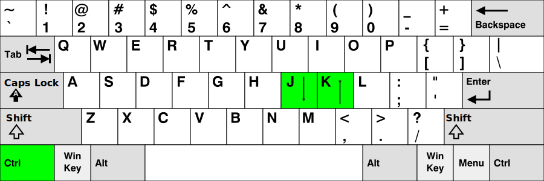

# sosaid (sosreport aid)
This is a patch for a `netrw` plugin in **Vim**, which allows you to quickly explore many files with very little effort.  
The resulting modified plugin is especially suitable for quick exploration of [sosreports](https://access.redhat.com/solutions/3592).

## What the patch offers?
- Quickly browses many files with an instant file preview
- Better focus on the problem that the customer reported
- Better chance of finding something other than just a reported problem
- Small set of basic shortcuts (`j`, `k`, `Ctrl-j`, `Ctrl-k`) to control
- The behavior of the plugin can be configured by the user [^1]
- The plugin can quickly browse any files on the system
- Smooth integration into the original `netrw` plugin

[^1]: modify the patch for a different behaviour or a different default configuration

## How to install or uninstall the modified netrw plugin?
```
# dnf install -y vim
$ mkdir -p ~/.vim/autoload
$ cd ~/.vim/autoload
$ cp /usr/share/vim/vim??/autoload/netrw.vim .
$ sed -n '/^" Version:\t/s///p' netrw.vim
170
$ patch < sosaid_netrw_170.patch
$ rm ~/.vim/autoload/netrw.vim		<--- uninstall
```
Is not there an exact version in the repository?
Try to apply the closest patch.

## How to use the plugin?
```
$ vim sosreport-12345678/

or just

$ vim .
```

## How to control the plugin?


## Description of the control shortcuts
| Shortcut | Functionality |
| -------- | ------------- |
| `j` | ↓ go down and preview the next file or the directory listing |
| `Ctrl-j` | ↓ go down to the directory if there is a directory on the active line |
| `Ctrl-j` | if there is a file on the active line, opens it in a new tab for further examination |
| `k` | ↑ go up and preview the previous file or the directory listing |
| `Ctrl-k` | ↑ go up one level from the current directory |

## Auxiliary shortcuts (also defined in `.vimrc`)
| Shortcut | Functionality |
| -------- | ------------- |
| `p` | display the item in the preview window (the first or the only item in the directory) |
| `Enter` | same as `Ctrl-j` |
| `Ctrl-l` | turn off the **highlighted** search string instead of typing `:noh` |
| `\` `c` | show/hide white characters |
| `\` `h` | split window horizontally |
| `\` `r` | list Vim [registers](#how-to-paste-a-register-to-the-command-line) |
| `\` `s` | sort a paragraph |
| `\` `v` | split window vertically |
| `\` `w` | wrap/unwrap long lines |

## How to process an examined file (command-line mode)
| Command | Functionality |
| -------- | ------------- |
| `:g/boring/d` | delete boring lines (mnemonic: **g**rep)|
| `:g!/interesting/d` | delete non-interesting lines |
| `:v/interesting/d` | delete non-interesting lines (mnemonic: grep -**v**) |
| `:w result.txt` | write the processed data to the `result.txt` file |
| `:tabonly` | Too many tabs opened? Close all but the current one. |

## How to paste a string to the command line
- `^r` `^w` means press `Ctrl-r` `Ctrl-w` to paste a `word` under the cursor to the command line
- `^r` `^a` means press `Ctrl-r` `Ctrl-a` to paste a `w:o-r.d` under the cursor to the command line
- `^r` `/` means press `Ctrl-r` `/` to paste the **\\<highlighted string\\>** (after `*` or `#`) to the command line
- `^r` `/` means press `Ctrl-r` `/` to paste the **highlighted string** (after `g` `*` or `g` `#`) to the command line

| Command | Functionality |
| -------- | ------------- |
| :v/`^r` `^w`/d | paste the `word` from examined file to the command line |
| :v/`^r` `^a`/d | paste the `w:o-r.d` from examined file to the command line |
| :g/`^r` `/`/d | paste the highlighted search string to the command line |
| `Ctrl-c` | cancel the command line and put the cursor to another `word` |

## How to paste a register to the command line
- `^r` `"` means press `Ctrl-r` `"` to paste the [unnamed register](#vim-help-shortcuts-registers-quickref) to the command line

| Shortcut | Functionality |
| -------- | ------------- |
| :g/`^r` `"`/d | paste the unnamed register to the command line |

## Built-in shortcuts (normal mode)
| Shortcut | Functionality |
| -------- | ------------- |
| `H` | move cursor to **H**igh or **H**ome of the window |
| `M` | move cursor to **M**iddle of the window |
| `L` | move cursor to **L**ow or **L**ast of the window  |
| `G` | jump to the end of file (the ending is sometimes the most interesting part) |
| `g` `g` | jump to the beginning of the file |
| `Ctrl-d` | scroll down half a screen |
| `Ctrl-u` | scroll up half a screen |
| `Ctrl-f` | scroll down a screen |
| `Ctrl-b` | scroll up a screen |
| `/` `filename` | search forward for a filename |
| `?` `filename` | search backward for a filename |
| `n` | search forward for a next filename |
| `N` | search backward for a previous filename |
| `g` `t` | move to the next tab |
| `Ctrl-PageDown` | move to the next tab (does not work in the `screen` program) |
| `g` `T` | move to the previous tab |
| `Ctrl-PageUp` | move to the previous tab (does not work in the `screen` program) |
| `Ctrl-w` `H` | move the active window to the right (vertical split window) |
| `Ctrl-w` `L` | move the active window to the left (vertical split window) |
| `Ctrl-w` `Ctrl-w` | move the cursor to the adjacent split window |
| `Ctrl-c` | cancel the listing of files in the directory (too many files) |
| `Ctrl-g` | print the full file name to the status bar |

## Vim help, shortcuts, registers, quickref
```
:tab h
:tab h index
:tab h registers
:tab h quickref
```

## How to learn Vim
```
$ vimtutor
```

- I am helpless, [how do I exit Vim](https://github.com/hakluke/how-to-exit-vim/blob/master/README.md)?

---

## How to create a patch with a bugfix or a new feature
```
$ sed -n '/^" Version:\t/s///p' /usr/share/vim/vim??/autoload/netrw.vim
165
$ diff -u /usr/share/vim/vim??/autoload/netrw.vim ~/.vim/autoload/netrw.vim > sosaid_netrw_165.patch
```

## Patches overview
| Release | Patch |
| ------- | ----- |
| RHEL6.10, RHEL7.9 | sosaid_netrw_149.patch |
| RHEL8.3 | sosaid_netrw_156.patch |
| Fedora 29 | sosaid_netrw_165.patch |
| Fedora 33 | sosaid_netrw_170.patch |

---
